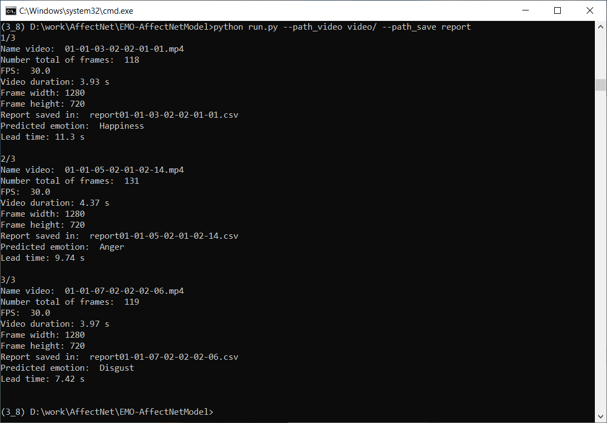
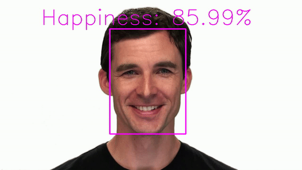
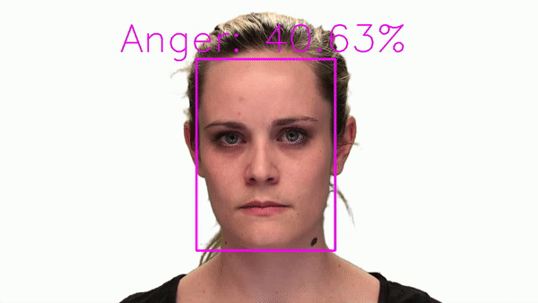

# In Search of the Robust Facial Expressions Recognition Model: The Visual Cross-Corpus Study

    
    
    

In this paper we present the largest visual emotion recognition cross-corpus study to date.  We suggested a novel and effective end-to-end emotion recognition framework consisted of two key elements, which are employed for differentfunctions:

(1) the backbone emotion recognition model, which is based on the VGGFace2 ([Cao et al., 2018](https://ieeexplore.ieee.org/document/8373813)) ResNet50 model ([He et al., 2016](https://ieeexplore.ieee.org/document/7780459)), trained in a balanced way, and is able to predict emotion from the raw image with high performance; 

(2) the temporal block stacked on top of the backbone model and trained with dynamic visual emotional datasets (RAVDESS ([Livingstone et al., 2018](https://journals.plos.org/plosone/article?id=10.1371/journal.pone.0196391)), CREMA-D ([Cao et al., 2014](https://ieeexplore.ieee.org/document/6849440)), SAVEE ([Haq et al., 2008](http://personal.ee.surrey.ac.uk/Personal/P.Jackson/pub/avsp08/HaqJacksonEdge_AVSP08.pdf)), RAMAS ([Perepelkina et al., 2018](https://doi.org/10.1007/978-3-319-99579-3_52)), IEMOCAP ([Busso et al., 2008](https://doi.org/10.1007/s10579-008-9076-6)), Aff-Wild2 ([Kollias et al., 2018](https://arxiv.org/abs/1811.07770))) using the cross-corpus protocol in order to show its reliability and effectiveness.

During the research, the backbone model was fine-tuned on the largest facial expression dataset AffectNet ([Mollahosseini et al., 2019](https://ieeexplore.ieee.org/document/8013713)) contained static images.  Our backbone model achieved an accuracy of 66.4 % on the AffectNet validation set. We achieved 66.5% accuracy using [label smoothing technique](https://arxiv.org/abs/1906.02629).

In this GitHub repository we propose for common use (for scientific usage only) [the backbone emotion recognition model](https://drive.google.com/drive/folders/1ahiKWj6gJ7yC2ye6vBEy0GJfdeguplq4?usp=drive_link) and [6 LSTM models](https://drive.google.com/drive/folders/1m7ATft4STye2Wiip3BZNUGIkducHC0SD?usp=drive_link) obtained as a result of leave-one-corpus-out cross-validation experiment.

### Table. Results (Unweighted average recall, UAR) of leave-one-corpus-out cross-validation

| Train datasets | Test dataset | Name model |UAR, % |
| - | ---- | ---- | ---- |
| RAVDESS, CREMA-D, SAVEE, RAMAS, IEMOCAP| Aff-Wild2 | Aff-Wild2 | 51,6 |
| Aff-Wild2, CREMA-D, SAVEE, RAMAS, IEMOCAP| RAVDESS | RAVDESS | 65,8 |
| Aff-Wild2, RAVDESS, SAVEE, RAMAS, IEMOCAP| CREMA-D | CREMA-D | 60,6 |
| Aff-Wild2, RAVDESS, CREMA-D, RAMAS, IEMOCAP| SAVEE | SAVEE | 76,1 |
| Aff-Wild2, RAVDESS, CREMA-D, SAVEE, IEMOCAP| RAMAS | RAMAS | 44,3|
| Aff-Wild2, RAVDESS, CREMA-D, SAVEE, RAMAS| IEMOCAP | IEMOCAP | 25,1|

We provide two static (backbone) models trained using the tensorflow framefork. Both [tensorflow models](https://drive.google.com/drive/u/2/folders/1wELaPME_WXvtgcWQyTvO3R8xXxg4NO8s) have been converted to [TorchScript models](https://drive.google.com/drive/folders/1Z53O_5OF3pf2Y3oEQn1hW3f4TLJFB3nH?usp=drive_link). To check four models on the AffectNet validation set, you should run ``check_tf_torch_models_on_Affectnet.ipynb``.

To check static (backbone) models by webcam, you should run ``check_backbone_models_by_webcam``. Webcam result:

    

We provide six temporal (LSTM) models trained using the tensorflow framefork. All [tensorflow models](https://drive.google.com/drive/folders/1rEO8Kwujtu-08RnuCej7k6YA0n309RyO?usp=drive_link) have been converted to [TorchScript models](https://drive.google.com/drive/folders/1IuGhp76DlusdNxM5iJzqOf44fpXk70zP?usp=drive_link). To check backbone and temporal models (CNN+LSTM) by webcam, you should run ``check_temporal_models_by_webcam``. Webcam result:

    

To predict emotions for all videos in your folder, you should run the command ``python run.py --path_video video/ --path_save report/``. 

To demonstrate the functioning of our pipeline, we have run it on several videos from the RAVDESS corpus. The output is: 
<h4 align="center"></h4>

To get new video file with visualization of emotion prediction for each frame, you should run the command ``python visualization.py``. Below are examples of test videos:

    
    
    

### Citation

If you are using EMO-AffectNetModel in your research, please consider to cite research [paper](https://www.sciencedirect.com/science/article/pii/S0925231222012656). Here is an example of BibTeX entry:

<pre>@article{RYUMINA2022,
  title        = {In Search of a Robust Facial Expressions Recognition Model: A Large-Scale Visual Cross-Corpus Study},
  author       = {Elena Ryumina and Denis Dresvyanskiy and Alexey Karpov},
  journal      = {Neurocomputing},
  year         = {2022},
  doi          = {10.1016/j.neucom.2022.10.013},
  url          = {https://www.sciencedirect.com/science/article/pii/S0925231222012656},
}

### Links to papers

- [Q. Cao, L. Shen, W. Xie, O. M. Parkhi and A. Zisserman, "VGGFace2: A Dataset for Recognising Faces across Pose and Age," 2018 13th IEEE International Conference on Automatic Face & Gesture Recognition (FG 2018), 2018, pp. 67-74, doi: 10.1109/FG.2018.00020.](https://ieeexplore.ieee.org/document/8373813)
- [K. He, X. Zhang, S. Ren and J. Sun, "Deep Residual Learning for Image Recognition," 2016 IEEE Conference on Computer Vision and Pattern Recognition (CVPR), 2016, pp. 770-778, doi: 10.1109/CVPR.2016.90.](https://ieeexplore.ieee.org/document/7780459)
- [S. R. Livingstone, F. A. Russo, "The ryerson audio-visual database of emo-tional  speech  and  song  (RAVDESS):  A  dynamic,  multimodal  set  of  facial  and  vocal  expressions  in  north  american  english,"  PLoS  One, vol. 13, no. 5, 2018, doi: 10.1371/journal.pone.0196391.](https://journals.plos.org/plosone/article?id=10.1371/journal.pone.0196391)
- [H. Cao, D. G. Cooper, M. K. Keutmann, R. C. Gur, A. Nenkova and R. Verma, "CREMA-D: Crowd-Sourced Emotional Multimodal Actors Dataset," IEEE Transactions on Affective Computing, vol. 5, no. 4, pp. 377-390,2014, doi: 10.1109/TAFFC.2014.2336244.](https://ieeexplore.ieee.org/document/6849440)
- [S. Haq, P. Jackson, J. R. Edge, "Audio-visual feature selection and reductionfor emotion classification," International Conference on Auditory-VisualSpeech Processing, 2008, pp. 185–190.](http://personal.ee.surrey.ac.uk/Personal/P.Jackson/pub/avsp08/HaqJacksonEdge_AVSP08.pdf)
- [O. Perepelkina, E. Kazimirova, M. Konstantinova, "RAMAS: Russian mul-timodal  corpus  of  dyadic  interaction  for  affective  computing," 20th International  Conference  on  Speech  and  Computer,  2018,  pp.  501–510, doi: 10.1007/978-3-319-99579-3_52.](https://doi.org/10.1007/978-3-319-99579-3_52)
- [C. Busso, M. Bulut, C. C. Lee, A. Kazemzadeh, E. Mower, S. Kim, J. N.Chang, S. Lee, S. S. Narayanan, "IEMOCAP: Interactive emotional dyadicmotion  capture  database,"  Language  Resources  and  Evaluation,42, 2008, doi: 10.1007/s10579-008-9076-6.](https://doi.org/10.1007/s10579-008-9076-6)
- [D. Kollias,  S. Zafeiriou,  Aff-Wild2:  Extending the Aff-Wild database for955affect recognition, ArXiv abs/1811.07770, 2018, pp. 1–8.](https://arxiv.org/abs/1811.07770)
- [A. Mollahosseini, B. Hasani and M. H. Mahoor, "AffectNet: A Database for Facial Expression, Valence, and Arousal Computing in the Wild," IEEE Transactions on Affective Computing, vol. 10, no. 1, pp. 18-31, doi: 10.1109/TAFFC.2017.2740923.](https://ieeexplore.ieee.org/document/8013713)
